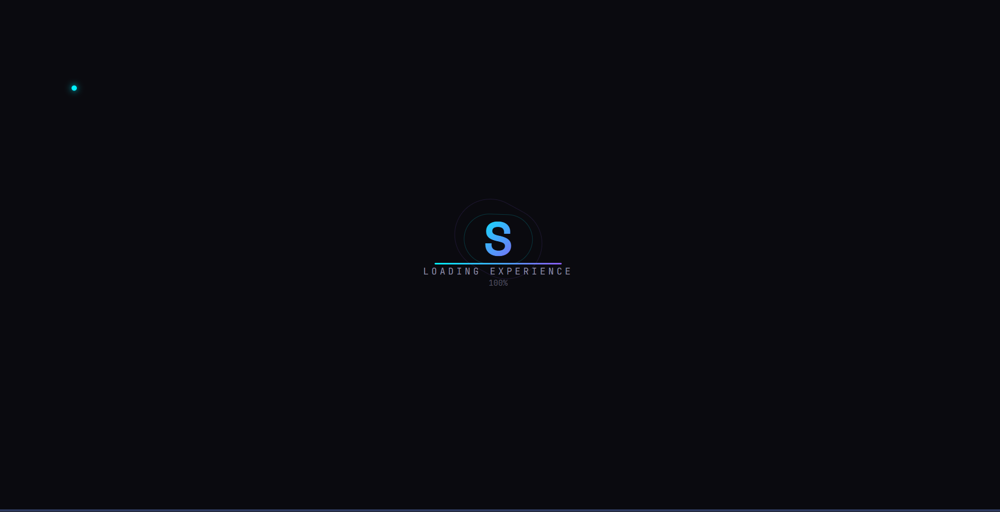
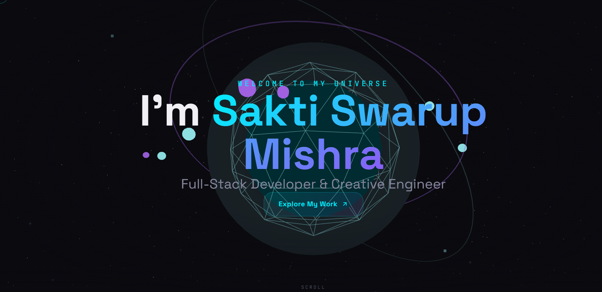

# Sakti Swarup Mishra| 3D Developer Portfolio

An immersive, interactive 3D developer portfolio built to showcase projects, skills, and experience. Designed with a focus on creative engineering, it leverages modern web technologies to deliver a high-performance, visually stunning experience.

<div align="center">
  
  
</div>

## ✨ Key Features

- **Immersive 3D Environments**: Interactive scenes, floating particles, and interactive 3D models built with **React Three Fiber** and **Three.js**.
- **Fluid Animations**: Smooth scrolling, page transitions, and element reveals powered by **GSAP** and **Framer Motion**.
- **Modern UI/UX**: Premium dark-mode aesthetic with neomorphic touches, dynamic gradients, and glassmorphism.
- **Custom Interactions**: A custom interactive cursor, page loader, and hidden easter eggs to enhance user engagement.
- **Responsive Layout**: Fully optimized for seamless viewing across desktop, tablet, and mobile devices.
- **State Management**: Lightweight, fast, and scalable global state handling using **Zustand**.

## 🛠️ Technology Stack

**Core**
- [React 19](https://react.dev/)
- [Vite](https://vitejs.dev/)

**3D Graphics & Animations**
- [Three.js](https://threejs.org/)
- [React Three Fiber](https://docs.pmnd.rs/react-three-fiber)
- [React Three Drei](https://github.com/pmndrs/drei)
- [GSAP](https://gsap.com/)
- [Framer Motion](https://www.framer.com/motion/)

**Styling**
- [Tailwind CSS v4](https://tailwindcss.com/)
- Vanilla CSS for specific animations and custom variables

**State Management**
- [Zustand](https://github.com/pmndrs/zustand)

## 🚀 Getting Started

Follow these instructions to get a copy of the project up and running on your local machine for development and testing purposes.

### Prerequisites

Make sure you have Node.js installed.
- Node.js (v18+ recommended)
- npm or yarn

### Installation

1. **Clone the repository:**
   ```bash
   git clone <repository-url>
   ```

2. **Navigate to the project directory:**
   ```bash
   cd 3D-Portfolio
   ```

3. **Install the dependencies:**
   ```bash
   npm install
   ```

4. **Start the development server:**
   ```bash
   npm run dev
   ```

5. **View the application:**
   Open your browser and navigate to `http://localhost:6789` (or the port shown in your terminal).

## 📁 Project Architecture

```text
3D-Portfolio/
├── public/               # Static assets (images, SVGs)
├── src/
│   ├── components/       # Reusable UI components (Navbar, Cursors, Loaders)
│   │   └── three/        # 3D specific components (Scenes, Planets, Particles)
│   ├── data/             # Static site data (Projects, Skills, Experience)
│   ├── hooks/            # Custom React hooks (useIntersectionObserver, etc.)
│   ├── sections/         # Main page sections (Hero, About, Contact, etc.)
│   ├── store/            # Zustand store configurations
│   ├── utils/            # Helper functions and animations
│   ├── App.jsx           # Main application wrapper and routing
│   ├── index.css         # Global styles and Tailwind configuration
│   └── main.jsx          # Application entry point
├── package.json          # Dependencies and scripts
└── vite.config.js        # Vite bundler configuration
```

## 👨‍💻 Author & Profile

**Sakti Swarup Mishra**  
*Full-Stack Developer & Creative Engineer*

- 📧 **Email:** [saktiswarupmishra5@gmail.com](mailto:saktiswarupmishra5@gmail.com)
- 📍 **Location:** Bhubaneswar, Odisha
- 🚀 **Availability:** Available for immediate joining | Willing to relocate and travel as required
- 🗣️ **Languages:** Fluent in English, Hindi, and Odia

### 💡 Interests & Highlights
- 🛡️ Strong interest in **Cybersecurity** & 🎮 **Game Development**
- 🏆 Active participant in hackathons and coding competitions

---

## 💼 Experience

### **Full-Stack Developer Trainee** | *RiseSmart Solution Private Limited*
📅 *December 2025 - March 2026 | Bhubaneswar, Odisha*
- **End-to-End Development:** Delivered comprehensive software development services from concept to deployment, building scalable and secure digital products.
- **Cross-Platform & Web:** Developed cross-platform mobile and responsive web applications using modern tech stacks.
- **Optimization & Security:** Implemented secure coding standards and performance optimization practices.
- **Cloud & Infrastructure:** Supported cloud integration, hosting, and backend infrastructure management.
- **CI/CD & DevOps:** Streamlined development workflows by integrating automated build and deployment pipelines, accelerating release cycles and enhancing collaboration across engineering teams.
- **API Integration:** Integrated third-party APIs and services to extend platform functionality and enable seamless interoperability with external systems.
- **Quality Assurance:** Focused on quality assurance, testing, continuous improvement, and serving industrial, enterprise, and software ecosystem markets.

### **Web Developer Internship** | *ITabet*
📅 *March 2025 - July 2025 | Bhubaneswar, Odisha*
- **Web Solutions:** Provided professional website development and regular maintenance services for a globally recognized digital marketing agency.
- **Digital Growth:** Assisted in customizing web strategies to increase online presence, improve visibility, and generate quality leads.
- **Platform Integration:** Supported initiatives involving Google My Business setups, targeted ad campaigns (Google/Meta), and social media integration to engage audiences across platforms.
- **Client Success:** Contributed to web projects aimed at building long-term, trust-based partnerships with clients worldwide.

---

## 🎓 Education

### **Master of Computer Application (MCA)**
🏛️ *Gandhi Engineering College, Bhubaneswar, Odisha*
📅 *Graduated: 2025 | CGPA: 8.00*
- **Specializations:** Artificial Intelligence, Cyber Security, Full Stack Development, and Java Development.

---

## 📄 License

© 2026 Sakti Swarup Mishra. All rights reserved.
